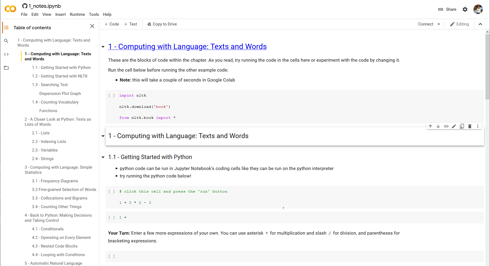

# NLTK-Book-Resource

## About

This repository is intended to be a starting point for students wanting to learn both Natural Language Processing concepts and the Python programming language using the NLTK book. [NLTK](https://www.nltk.org/) is short for "Natural Language Toolkit", a set of linguistic tools used to analyze text for educational and research purposes. The [NLTK book](https://www.nltk.org/book/) aims to teach users common Natural Language Processing concepts and Python 3.0 simultaneously. The book also introduces other important concepts to general programming and Data Science, including:

* data collection
* data manipulation
* data structures
* machine learning
* readable and structured program writing

There are no pre-requisites for this program. It assumes no programming experience. If you already have some programming experience in Python, you can still use this resource to learn NLTK. Refer to the [NLTK Book Preface](https://www.nltk.org/book/ch00.html) for more information regarding which chapters to use.

### Program

The contents of this repository will teach students how to set up an environment to run python code to learn NLTK. Each chapter of the NLTK book has a set of [Jupyter Notebooks](https://jupyter.org/) where students can write notes as well as well as run code. The types of Jupyter Notebooks for each chapter in this repository are described in this table:

| Type                   | File Name            | Description                                                  |
| ---------------------- | -------------------- | ------------------------------------------------------------ |
| **Notes and Examples** | `##_notes.ipynb`     | notebook with runnable code from examples provided in the book as well as tips and resources to accompany the text |
| **Exercises**          | `##_exercises.ipynb` | notebook to work on chapter exercises                        |
| **Exercise Solutions** | `##_solutions.ipynb` | selected solutions to review challenging material            |

The [Initial Setup Notebook](https://colab.research.google.com/github/BetoBob/NLTK-Book-Resource/blob/master/setup.ipynb) explains how to run and save these notebooks. Students can choose to use either an [Anaconda](https://www.anaconda.com/products/individual) installation of NLTK and Jupyter Notebooks on their computer, or use [Google Colab](https://colab.research.google.com/notebooks/intro.ipynb#) in a web browser (with some limitations). Instructions to install and use Anaconda or Google Colab are provided in the Initial Setup Notebook. 

The **Notes and Examples** notebook can be used to run and edit example code in the book to have a better conceptual understanding of how the code work. Tips and references to modern resources such as datasets, Python libraries, APIs and tutorials will be given throughout these notes as well. Students are also encouraged to try the chapter exercises in the **Exercises** notebook, and use the **Exercise Solutions** notebooks to understand more challenging problems.

## Resources

This repository is **currently under construction**. Content for new chapters will be added throughout the year. For any inquiries email me at rehensle@calpoly.edu and for any specific issues or suggestions with the Jupyter Notebooks, create a new issue in the **Issues** tab of this repository.

* Survey (currently unavailable)
* Feedback Form (currently unavailable)

### Platforms

* [Jupyter Notebooks](https://jupyter.org/)

* [Anocanda Individual Edition](https://www.anaconda.com/products/individual)
* [Google Colab](https://colab.research.google.com/notebooks/intro.ipynb#)

### NLTK

* [NLTK Documentation](https://www.nltk.org/)

* [NLTK Book Link](http://www.nltk.org/book)
* [NLTK Book Repository](https://github.com/nltk/nltk_book)

## Table of Contents 

* [Initial Setup (Start Here!)](https://colab.research.google.com/github/BetoBob/NLTK-Book-Resource/blob/master/setup.ipynb)

### 1. Language Processing and Python

* [Chapter 1 Text](http://www.nltk.org/book/ch01)
* [Chapter 1 Notes and Examples](https://colab.research.google.com/github/BetoBob/NLTK-Book-Resource/blob/master/01/01_notes.ipynb)
* [Chapter 1 Exercises](https://colab.research.google.com/github/BetoBob/NLTK-Book-Resource/blob/master/01/01_exercises.ipynb)
* [Chapter 1 Exercise Solutions](https://colab.research.google.com/github/BetoBob/NLTK-Book-Resource/blob/master/01/01_solutions.ipynb)

### 2. Accessing Text Corpora and Lexical Resources

* [Chapter 2 Text](https://www.nltk.org/book/ch02.html)
* [Chapter 2 Notes and Examples](https://colab.research.google.com/github/BetoBob/NLTK-Book-Resource/blob/master/02/02_notes.ipynb)
* [Chapter 2 Exercises](https://colab.research.google.com/github/BetoBob/NLTK-Book-Resource/blob/master/02/02_exercises.ipynb)
* [Chapter 2 Exercise Solutions](https://colab.research.google.com/github/BetoBob/NLTK-Book-Resource/blob/master/02/02_solutions.ipynb)

### 3. Processing Raw Text

* [Chapter 3 Text](http://www.nltk.org/book/ch03)
* [Chapter 3 Notes and Examples](https://colab.research.google.com/github/BetoBob/NLTK-Book-Resource/blob/master/03/03_notes.ipynb)
* [Chapter 3 Exercise Solutions](https://colab.research.google.com/github/BetoBob/NLTK-Book-Resource/blob/master/03/03_solutions.ipynb)

### 4. Writing Structured Programs

* [Chapter 4 Text](http://www.nltk.org/book/ch04)

### 5. Categorizing and Tagging Words

* [Chapter 5 Text](http://www.nltk.org/book/ch05)

### 6. Learning to Classify Text

* [Chapter 6 Text](http://www.nltk.org/book/ch06)

### 7. Extracting Information from Text

* [Chapter 7 Text](http://www.nltk.org/book/ch07)

### 8. Analyzing Sentence Structure

* [Chapter 8 Text](http://www.nltk.org/book/ch08)

### 9. Building Feature Based Grammars

* [Chapter 9 Text](http://www.nltk.org/book/ch09)

### 10. Analyzing the Meaning of Sentences

* [Chapter 10 Text](http://www.nltk.org/book/ch10)

### 11. Managing Linguistic Data

* [Chapter 11 Text](http://www.nltk.org/book/ch11)

### 12.

* [Afterword](https://github.com/BetoBob/NLTK-Book-Resource/blob/master/afterword.md)