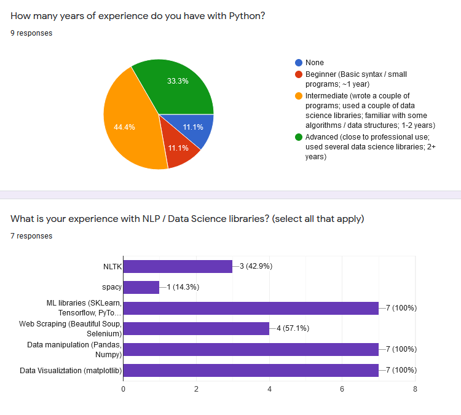

# NLTK-Book-Resource Demo

This is a project demo for the NLTK-Book-Resource. The first section of this demo covers the content of the NLTK-Book-Resource. The second section covers some key findings from community members which will shape the direction of the project in the future.

## Implementation

This repository is intended to be a starting point for students wanting  to learn both Natural Language Processing concepts and the Python  programming language using the NLTK book. [NLTK](https://www.nltk.org/) is short for "Natural Language Toolkit", a set of linguistic tools used to analyze text for educational and research purposes. The [NLTK book](https://www.nltk.org/book/) aims to teach users common Natural Language Processing concepts and Python 3.0 simultaneously. 

### Main README

* [Main README](https://github.com/BetoBob/NLTK-Book-Resource)

The README for the NLTK Book Resource acts as the landing page for the project. The top of the page has a brief one sentence summary of the project, followed by a link to the setup notebook (discussed below). After this is contact information for the project, including a survey and feedback form for project input. There is also a link for a [Discord study group](https://discord.com/invite/7XrEgH6ASt) that is linked to the project (discussed below).

After this is a more detailed 'About' section that covers what NLTK is used for, how the resource is to be used, and how the repository is structured. Each chapter has a `##_notes.ipynb`, `##_exercises.ipynb` and `##_solutions.ipynb` notebook files along with data used in the chapter examples / exercises and README with links to Chapter subsections and links to helpful resources related to the chapter. The content of each notebook will be explained in greater detail below.

### Setup Notebook

* [Setup Notebook](https://colab.research.google.com/github/BetoBob/NLTK-Book-Resource/blob/master/setup.ipynb#scrollTo=0uCoTsKRObLJ)

The Setup Notebook explains how to run and save these notebooks. Students can choose to use either an [Anaconda](https://www.anaconda.com/products/individual) installation of NLTK and Jupyter Notebooks on their computer, or use [Google Colab](https://colab.research.google.com/notebooks/intro.ipynb#) in a web browser (with some limitations). Instructions to install and use Anaconda or Google Colab are provided in the Initial Setup Notebook. While the student can do most of the exercises in Colab, they are encouraged to use a local instance of Jupyter Notebooks so they don't need to re-download large datasets (such as large corpora datasets) each time they are running a new Colab notebook instance.

### Notes

* [Chapter 4 Notes](https://colab.research.google.com/github/BetoBob/NLTK-Book-Resource/blob/master/04/04_notes.ipynb)

The notes notebooks include all example code from the book in an easily navigable format. Students are intended to read the Chapter text and run the example code in the Jupyter Notebooks. The notebook format allows students not only to see the output of the example code, but also to manipulate the code to get a better conceptual understanding of what is happening when the code is run. It also allows students to easily reproduce snippets of code for relevant coding exercises. 

### Exercises

* [Chapter 2 Exercises](https://colab.research.google.com/github/BetoBob/NLTK-Book-Resource/blob/master/02/02_solutions.ipynb)

Chapter exercises have two separate notebooks. The `exercises` notebook contains a canvas with the Chatper’s exercise questions and the contains selected solutions to the book’s exercises. Each exercise contains the complete text to the problem, as well as code if it is provided by the problem and some notes / hints if a problem needs extra clarification that the book does not provide. 

Solutions to exercise solutions are verbose and intend to show each step towards obtaining a desired solution. Because some exercises have multiple approaches towards obtaining a solution, some solutions such as the ones in the [Chapter 2 Exercise Solutions](https://colab.research.google.com/github/BetoBob/NLTK-Book-Resource/blob/master/02/02_solutions.ipynb) contain a simple solution and a more advanced solution. Not all solutions are provided.

### Discord

* [NLTK Book Study Group](https://discord.gg/7XrEgH6ASt)

The server acts as a place to discuss concepts in the book as well as other NLP / python resources. There are individual text channels for each Chapter in the book and channels to discuss about the python library or other NLP libraries. Additionally, the server provides a space for collaborators to discuss how the NLTK Book Resource can be improved, with a specific channel for the NLTK-Book-Resource itself. The intention of this channel is to provide a space for self-learners to discuss challenging content in the book as well as provide feedback / maintenance suggestions for the NLTK-Book-Resource moving forward. There are currently over 200 members.

## Testing

### Demographics

* [PDF of Discord responses (11/19)](responses.pdf)

While the feedback forms for the NLTK resource have not yet been completed, there were several responses to a poll from the NLTK Book Discord Group. This gives some insight into what kind of self-learners are interested in using this book.

As of right now, it looks like more users who are interested in using this resource have Python experience and would prefer to move quickly through the introductory Python sections of the book (Chapters 1 - 4). In the NLTK Book Study Group discord, several users are linguistics students, some of whom have had experience using Python and others who are new to Python. A majority of members on the server tend to have at least some background using Python and data science tools. This is because a majority of members introduced to the projects were from Data Science learning communities online. 

### Issue Tracking

* [Github Projects Page](https://github.com/BetoBob/NLTK-Book-Resource/projects)

All issues with the notes and exercise solutions are tracked in Github Projects Page for the repository. Issues can also be reported in the NLTK Book Study Group discord page in the `NLTK-Book-Resource` channel.

