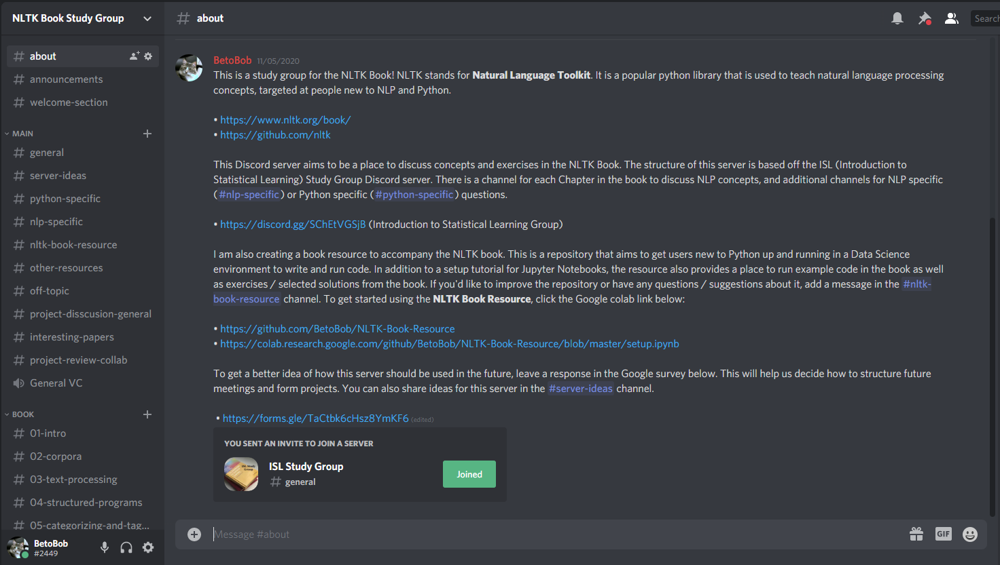

# NLTK-Book-Resource Demo

This is a project demo for the NLTK-Book-Resource. The first section of this demo covers the content of the NLTK-Book-Resource. The second section covers some key findings from community members which will shape the direction of the project in the future.

## Implementation

This repository is intended to be a starting point for students wanting  to learn both Natural Language Processing concepts and the Python  programming language using the NLTK book. [NLTK](https://www.nltk.org/) is short for "Natural Language Toolkit", a set of linguistic tools used to analyze text for educational and research purposes. The [NLTK book](https://www.nltk.org/book/) aims to teach users common Natural Language Processing concepts and Python 3.0 simultaneously. 

### Main README

* [Main README](https://github.com/BetoBob/NLTK-Book-Resource)

The README for the NLTK Book Resource acts as the landing page for the project. The top of the page has a brief one sentence summary of the project, followed by a link to the setup notebook (discussed below). After this is contact information for the project, including a survey and feedback form for project input. There is also a link for a [Discord study group](https://discord.com/invite/7XrEgH6ASt) that is linked to the project (discussed below).

### Setup Notebook

* [Setup Notebook](https://colab.research.google.com/github/BetoBob/NLTK-Book-Resource/blob/master/setup.ipynb#scrollTo=0uCoTsKRObLJ)

The Setup Notebook explains how to run and save these notebooks. Students can choose to use either an [Anaconda](https://www.anaconda.com/products/individual) installation of NLTK and Jupyter Notebooks on their computer, or use [Google Colab](https://colab.research.google.com/notebooks/intro.ipynb#) in a web browser (with some limitations). Instructions to install and  use Anaconda or Google Colab are provided in the Initial Setup Notebook.

### Notes

### Exercises

### Discord

## Testing

While the feedback forms for the NLTK resource have not yet been completed, there were several responses 